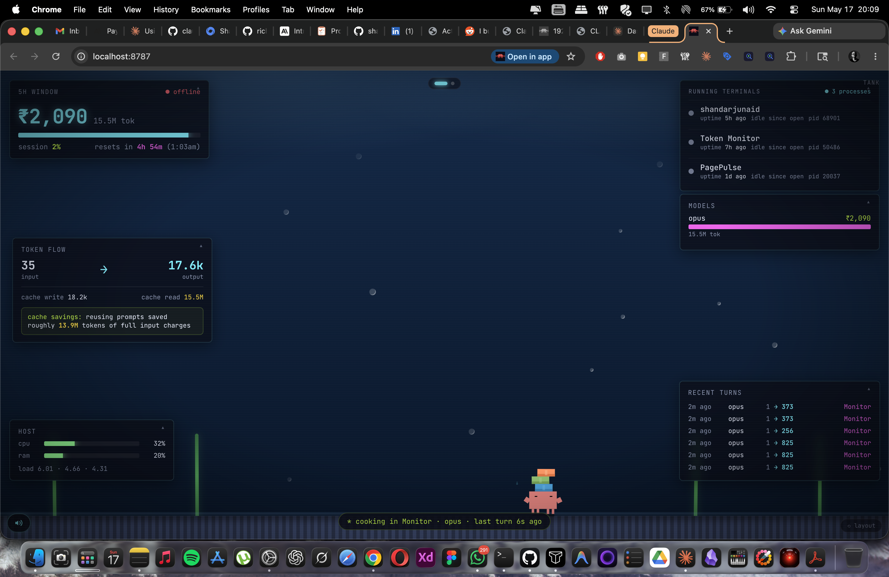
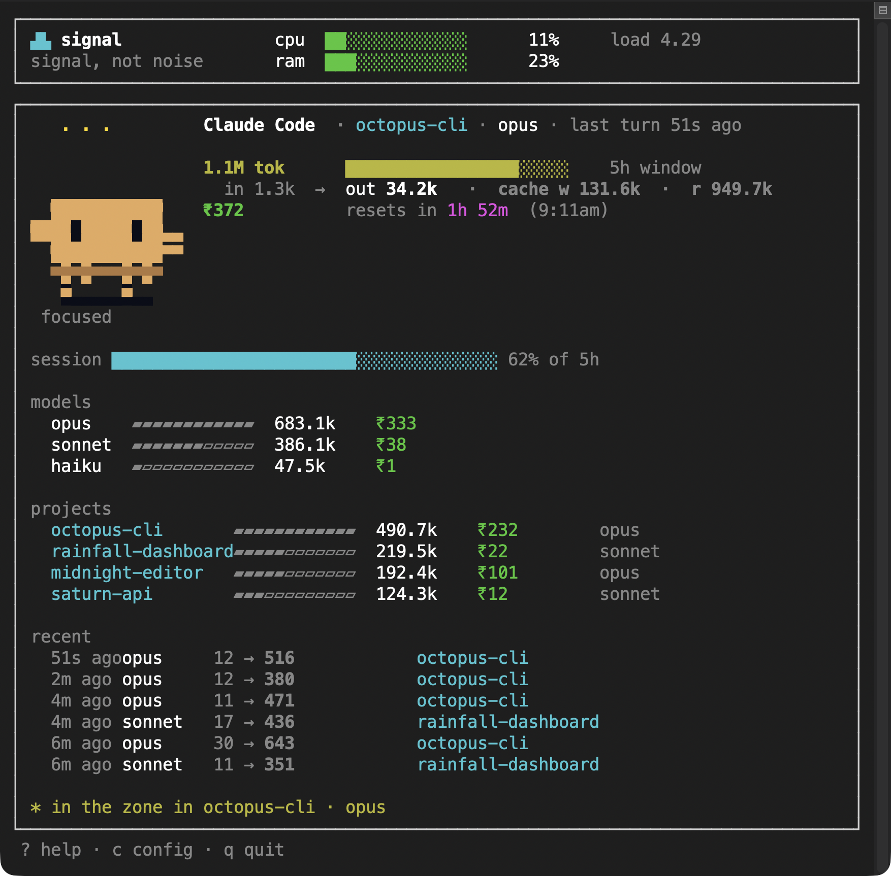

# signal

Multi-provider usage monitor for AI coding agents. **Signal, not noise.**

`signal` watches your AI coding usage (Claude Code, OpenAI Codex CLI) and host hardware, and renders it two ways: a terminal TUI, and a live web tank that runs on any browser on your Wi-Fi — phone, tablet, MacBook, external display. Built by [Affordance Design Studio](https://affordance.design). MIT.



## For Codex testers

If you use [OpenAI Codex CLI](https://github.com/openai/codex) and want to try signal on your data:

```bash
# Clone + build (only requires Bun — get it from https://bun.sh)
git clone https://github.com/shandar/signal.git
cd signal
bun install
cd web && bun install && bun run build && cd ..
bun run compile

# Run it
./dist/signal serve
# Open the URL it prints (http://localhost:8787 + the LAN URL for your phone)
```

On boot the daemon prints which providers it found:

```
providers: ● Claude   ● Codex
```

If only Codex is detected, you'll see your Codex sessions, models, projects, recent turns, and 5h-window cost in ₹. The web tank renders Codex data exactly the way Claude users see theirs. **No keychain prompts, no auth setup** — Codex bakes its rate-limit data into the JSONL session logs already on your disk.

What `signal` reads:
- `~/.codex/sessions/<Y>/<M>/<D>/rollout-*.jsonl` — session events, token counts, rate limits
- `ps -ef` + `lsof` — running `codex` CLI processes by working directory (so you see *which terminals* are alive)

Nothing leaves your machine. No telemetry, no accounts, no API keys.

When you spot something off or missing, file an issue at [github.com/shandar/signal/issues](https://github.com/shandar/signal/issues) — paste the output of `./dist/signal doctor` and a brief description.

## Two surfaces

`signal` ships one daemon with two display modes — pick whichever fits the moment.

### Terminal TUI (`signal`)

A live, full-screen TUI built with Ink. Hardware strip on top, provider summary in the middle, animated pixel-art crab as the mood indicator. Best when you're already in the terminal and want the data inline.



```bash
signal                 # live TUI — default command
signal status          # one-shot summary table (exit 0/1/2 by severity)
signal json            # machine-readable snapshot
signal doctor          # diagnose adapter detection + auth + hardware
signal config          # edit ~/.signal/config.toml in $EDITOR
```

### Web tank (`signal serve`)

A pixel-art aquarium served by a local daemon. WebSocket pushes turn data within ~250ms; any browser on the same Wi-Fi can connect. The crab walks under glass data panels showing cost, tokens, recent turns, running terminals, and host hardware.

```bash
signal serve           # start the daemon — prints local + LAN URLs to open
signal serve -p 9000   # custom port
```

On your phone, point the browser at the LAN URL the daemon prints (e.g. `http://192.168.1.42:8787`) and Share → **Add to Home Screen**. PWA manifest ships with the page so it installs like a native app.

## Features

- **Multi-provider** — Claude Code and OpenAI Codex CLI sessions in one dashboard. Floating provider-switcher pill when both have data; single-provider users see their data exactly like before. No OAuth dance for Codex (rate limits ship inside the JSONL).
- **Multi-surface** — one daemon, two display modes: terminal TUI and web tank. The web bundle works on phone / tablet / browser / external display. Future: Tauri menu-bar and borderless desktop window.
- **Live data over WebSocket** — every Claude or Codex turn pushes to all connected clients within ~250ms (via `fs.watch` + per-provider polling).
- **Running terminals detector** — finds every active `claude` and `codex` CLI process by working directory and groups subagent children. See which projects are *actually* alive right now, tagged by provider.
- **Animated pixel-art crab** — [Marcio Granzotto's clawd-tank](https://github.com/marciogranzotto/clawd-tank) (MIT) drives the mood indicator: chill → focused → cooking → on-fire as your 5h token spend climbs. Same crab in terminal (truecolor half-blocks) and web (SVG with CSS keyframes).
- **Token-flow + cache savings** — input → output flow with cache-write / cache-read split. Quantifies prompt-cache savings against full-input pricing.
- **Mini-game** — tap the water on the web tank; food drops, crab walks over, eats with a sparkle. Synthesized footstep / splash / sparkle audio (no asset files).
- **INR-first cost** — Indian lakh/crore-style grouping. Tap the headline to flip to USD.
- **Phone widget grid** — 7 chips with expandable detail sections; cards are draggable on desktop.
- **Toasts** — pop on every new turn and mood transition.
- **Settings page** — FX rate, mood thresholds, sounds toggle, mini-game toggle.

## Install

For now, build from source. Requires [Bun](https://bun.sh).

```bash
git clone https://github.com/shandar/signal.git
cd signal
bun install
cd web && bun install && bun run build && cd ..
bun run compile
# Produces ./dist/signal — a single self-contained binary.
# Move it onto your $PATH or run it from the repo:
./dist/signal           # live TUI
./dist/signal serve     # web tank daemon
```

Coming soon: `brew install affordance/tap/signal` (Homebrew tap) and `npm install -g @affordance/signal` (npm). Neither is published yet — see [Status](#status) for the roadmap.

## Architecture

```
~/.claude/projects/*.jsonl   ←  Claude Code writes turns here
~/.codex/sessions/.../*.jsonl ←  Codex CLI writes turns here
                │
                ▼
        signal daemon (Bun + Bun.serve)        ← `pgrep` + `lsof` for live process detect
                │  fs.watch + per-provider poll
                ▼
        SQLite event store at ~/.signal/events.db
                │  aggregateProvider() → ProviderSummary
                ▼
            WebSocket  /ws  pub/sub
                │
   ┌────────┬───┴────┬─────────┬─────────────┐
   ▼        ▼        ▼         ▼             ▼
terminal  phone   browser   tablet   external display
 (TUI)    (PWA)    (any)    (PWA)    (kiosk on TV)
```

Same `web/dist/` bundle on every browser surface. Pull-to-refresh on phone, the WebSocket reconnects automatically. iOS Safari background-throttle detected via a local heartbeat and the connection is forced back open when the tab returns.

## Configuration

`signal config` opens `~/.signal/config.toml`. Defaults:

```toml
enabledProviders = ["claude", "codex"]
dbPath = "~/.signal/events.db"

[hardware]
sampleIntervalMs = 2000
useSystemInformation = true

[claude]
useOauth = false   # set true (or run `signal auth claude`) for exact % utilization
```

User-side preferences (currency, FX rate, mood thresholds, sounds, layout) are stored in browser `localStorage` per device.

## How it works

`signal` reads `~/.claude/projects/*.jsonl` (Claude Code) and `~/.codex/sessions/<Y>/<M>/<D>/rollout-*.jsonl` (Codex CLI) — the same logs each CLI writes for every turn — and aggregates them in a SQLite event store at `~/.signal/events.db`. A `fs.watch` on the projects directories pushes new turns into the daemon within ~250ms, which broadcasts them to all WebSocket clients.

For "what processes are alive *right now*," the daemon runs `pgrep -f` + `lsof -d cwd` on every snapshot, groups by working directory, and surfaces the list to the UI with a pulsing-dot live/recent/idle classification.

Hardware sampling (CPU, RAM, load average, GPU on macOS) runs continuously while the daemon is up. Baseline uses Node's `os` module; install the optional `systeminformation` dep for per-core CPU, memory pressure, and richer GPU metrics.

Nothing leaves your machine. No telemetry, no accounts, no API keys to manage.

## Credits

The animated pixel-art crab (`web/public/clawd/*.svg` and the terminal port in `src/ui/tui/Crab.tsx`) is from [clawd-tank](https://github.com/marciogranzotto/clawd-tank) by **Marcio Granzotto Rodrigues**, used under the MIT License. See `web/public/clawd/NOTICE.md`.

## Status

- **v0.1.0** — terminal TUI + Claude adapter (tagged release).
- **v0.2.0** *(upcoming)* — web tank, multi-provider (Codex), live process detection, multi-surface PWA.

Follow-on plans, in priority order:
1. **Tauri menu-bar wrapper** — `signal-bar` sits in your Mac menu bar; click opens the same web tank in a popover
2. **Tauri borderless desktop window** — `signal-tank` floats in a corner of your screen, always-on-top
3. **Cursor / Gemini / Copilot adapters** — multi-provider beyond Claude + Codex
4. **ROI layer** — join the `git_commits` table to `events` for cost-per-PR
5. **Homebrew tap + notarized binaries + npm publish workflow** — proper distribution
